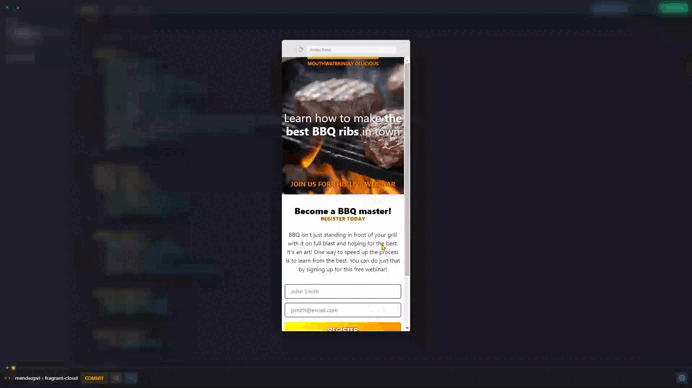

# Product Splash Page

## *Overview* 🌟

This project is part of the Responsive Design module in [**Scrimba**](https://v2.scrimba.com/home)’s [**Frontend Career Path**](https://v2.scrimba.com/the-frontend-developer-career-path-c0j) course. The goal of this page is to present a product in a visually appealing and accessible way, using advanced CSS and HTML concepts to achieve a responsive design that adapts to various devices.

## *Screenshot* 📷

## *Links* 🔗

[Scrim code](https://v2.scrimba.com/s07396uhq2) 👈

[Live site](https://mendezpvi.github.io/fcp-product-splash-page/) 👈

[Scrimba projects repository](https://github.com/mendezpvi/fcp-scrimba) 👈

## *What I learned* 🤓

🔳 **Text Case Manipulation:** I learned to use CSS properties like `text-transform` to control text capitalization and better adapt the visual style of content.

🔳 **Viewport Units:** I used viewport-relative units (`vw`, `vh`) to create a design that adapts to different screen sizes.

🔳 **Flexbox Order:** By applying the order property in Flexbox, I could reorganize elements at different resolutions, improving the visual structure on mobile devices.

🔳 **Box-sizing:** I gained a deeper understanding of how `box-sizing: border-box` affects the total size of elements and how to use it to create balanced and aligned layouts.

🔳 **Styling Form Elements and Modifiers:** I experimented with styling form elements, including input fields, buttons, and hover/focus styles, to enhance user experience and accessibility.

## *Resources* 🗃️

🗃️ [Frontend Career Path](https://v2.scrimba.com/the-frontend-developer-career-path-c0j) by Scrimba

🗃️ [Guide to Flexbox](https://css-tricks.com/snippets/css/a-guide-to-flexbox/) by CSS-Tricks

## *Author* 🔰

✨ X (formerly Twitter) - [@medezpvi](https://x.com/mendezpvi)