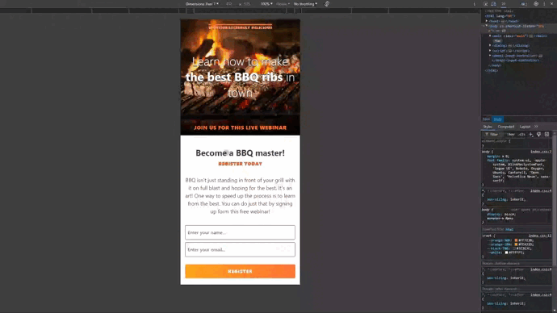

# Product Splash Page

This project is a landing page (Splash Page) designed to practice using Flexbox in CSS. The page promotes a free webinar on how to make the best BBQ ribs in town.

## Screenshots :camera:

### 📱 Mobile

### 💻 Desktop

## Links :link:

[Live site URL](https://mendezpvi.github.io/fcp-product-splash-page/) 👀

[FCP Projects](https://github.com/mendezpvi/fcp-scrimba) 👀

## Author :beginner:

✨ Frontend Mentor - [@mendezpvi](https://www.frontendmentor.io/profile/mendezpvi)